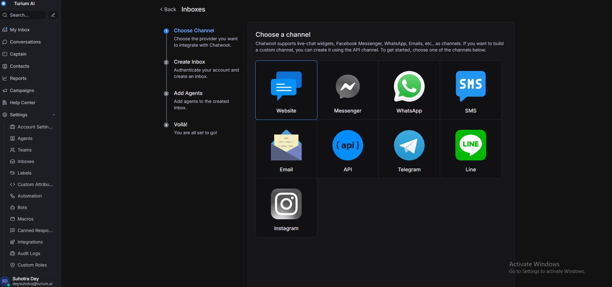

# 🧩 AFFiNE + Chatwoot Integration with Multi-Tenant White Labelling

This project integrates [AFFiNE](https://github.com/toeverything/AFFiNE) with [Chatwoot](https://www.chatwoot.com/) and adds full multi-tenant white-labelling support based on subdomain or query param.

> 🛠 Built using Docker Compose, React, and a minimal tenant backend.

---

## 🚀 Getting Started

### 1. Clone the Repository

```bash
git clone https://github.com/[your-username]/affine-chatwoot-task.git
cd affine-chatwoot-white-label
```

### 2. Prepare Chatwoot Database

```bash
docker compose run --rm rails bundle exec rails db:chatwoot_prepare
```

### 3. Start All Services

```bash
docker compose up -d
```
--
if the clone fails to run the docker container clone the affine source code from https://github.com/Lucifer4255/AFFiNE#

This will start:
- ✅ AFFiNE (on `http://localhost:8080`)
- ✅ Chatwoot (on `http://localhost:3000`)
- ✅ Tenant Backend (on `http://localhost:4000`)

---

## 🏷️ Branding & Tenant Configuration

### 🔍 View Existing Tenants

To view all registered tenants:

```bash
http://localhost:4000/api/tenants
```

This will return a list of tenants with their:
- ID
- Name
- Logo
- Theme color
- Chatwoot Widget Id
- Chatwoot Base URL

---

### 🛠️ Create a Chatwoot Widget (Inbox Setup)

1. Go to Chatwoot dashboard:  
   👉 `http://localhost:3000`

2. Complete onboarding and create a new **Inbox** under the **Website** tab from settings.

📸 *[]*

3. Once created, you'll receive a **Widget Token** (e.g., `sZZsYCPifpym86sUzR8NfpaF`)
📸 *[]*
---

### 🔗 Add Chatwoot Widget to Tenant

Make a `PATCH` request to your backend:

```http
PATCH http://localhost:4000/api/tenants/<tenant-id>
Content-Type: application/json

{
  "chatwootWidgetId": "your-widget-token-from-chatwoot"
}
```

📸 *[]*

This associates the Chatwoot inbox with the tenant.

---

### 🌐 Launch a Tenant-Specific Workspace

You can access tenants via:

#### 1. Subdomain (if supported in dev)

```bash
http://acme.localhost:8080
```

#### 2. URL Parameter

```bash
http://localhost:8080/?tenant=acme
```

Once loaded, you'll see:
- ✅ Custom theme color
- ✅ Tenant logo
- ✅ Chatwoot widget for support

📸 *[]*

---

## ➕ Adding a New Tenant

To add a new tenant, either:

1. Use a local `tenants.json` file (if backend not enabled), or  
2. Use a POST API to `http://localhost:4000/api/tenants`

You need to provide:

```json
{
  "id": "globex",
  "name": "Globex Corp",
  "logo": "/logos/globex.svg",
  "theme": "#3498db",
  "chatwootWidgetId": "EsL5CsmAHmqLwF1o9uDmmoF3",
  "chatwootBaseUrl": "http://localhost:3000"
}
```

---

## 🧠 How Branding Works

- Tenant info is loaded dynamically on page load via `TenantProvider`
- Based on `?tenant=` param or subdomain
- Injects:
  - Theme color via `Next-Themes`
  - Logo via avatar.tsx component(logos served in public folder)
  - Chatwoot widget using their JS SDK and widget token

---

## 🧰 Stack

- 🔧 **Docker Compose** for orchestration
- 🧠 **React + AFFiNE** for UI
- 💬 **Chatwoot** for support
- ⚙️ **Node.js (Express)** for multi-tenant backend

---


## 🎥 Demo Video

📺 [https://www.loom.com/share/410f93602554402cb7d32e8cf3752fea?sid=d9fd3215-4780-42d1-85b9-c1b7b3493366]

---

## ✅ Areas of Improvement

- Final styling polish
- Improve the DOcker files for production and development build
- improve the tenant backend with type guarding and a proper db if necessary for the job
